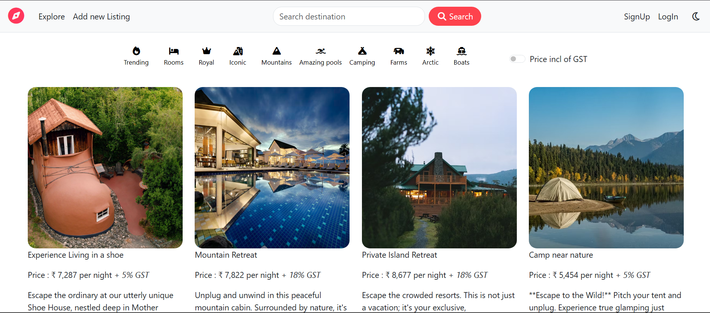
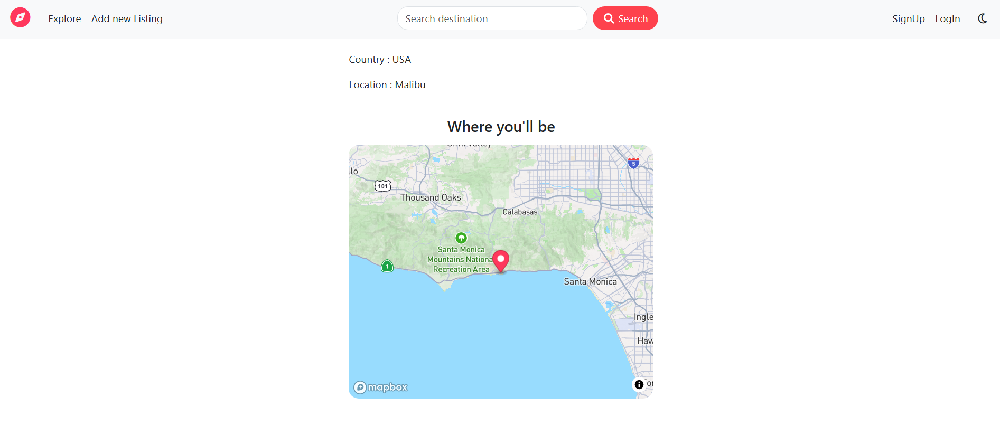
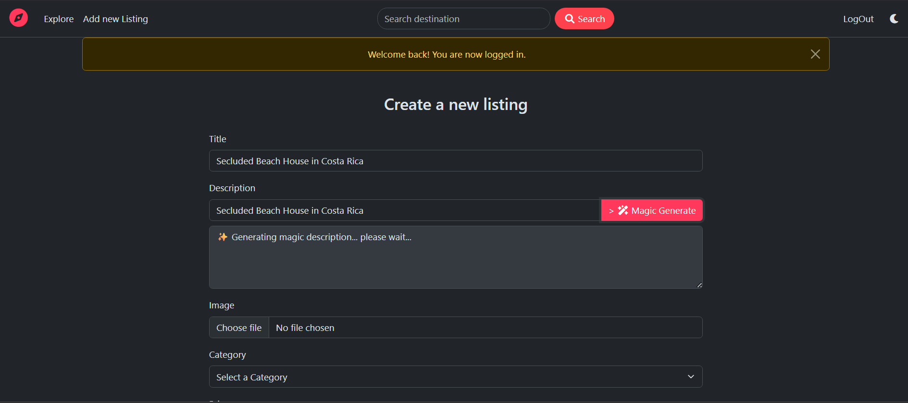
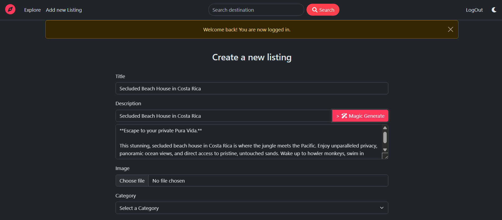

# ✈️ WanderLust

> A full-stack travel platform (Airbnb clone) built to master the MERN stack. It handles real-world complexity like geospatial mapping, image uploads, and server-side validation.

🔴 **Live Demo:** https://wanderlust-zxrz.onrender.com/listings

---

### 💻 Project Highlights

- **AI-Assisted Listing:** Integrated **Google Gemini AI** so users can auto-generate creative property descriptions with one click.
- **Geospatial Mapping:** Used **Mapbox** and **GeoJSON** to pin properties on an interactive map and search by location.
- **Dark Mode Support:** Fully responsive UI with a seamless toggle between Light and Dark themes.
- **Data Integrity:** Implemented **Joi** for server-side schema validation to ensure only valid data reaches MongoDB.
- **Authentication:** Secure login/signup system built with **Passport.js** (PBKDF2 hashing) and persistent sessions.
- **Image Management:** Listings support image uploads, optimized and stored directly in the cloud via **Cloudinary**.
- **MVC Pattern:** Organized the backend into Models, Views, and Controllers to keep the codebase modular and scalable.
- **Error Handling:** Wrote custom middleware to catch asynchronous errors and display meaningful feedback to users.
- **Flash Messages:** Added immediate user feedback (success/error alerts) for actions like creating or deleting listings.

### 🛠️ Tech Stack

- **Frontend:** EJS, Bootstrap 5, CSS3, JavaScript
- **Backend:** Node.js, Express.js
- **Database:** MongoDB (Atlas), Mongoose
- **Integrations:** Google Gemini 1.5 Flash, Mapbox GL JS, Cloudinary
- **Libraries:** Joi, Passport.js, Multer, Helmet

### 📸 Screenshots

1. **The Home Page:**


2. **The Map View:**


3. **The "Generate with AI" Feature:**



4. **Dark Mode Integration:**


### 👤 Author

**Antariksh Kothari**

- 🌐 [GitHub Profile](https://github.com/Antariksh62)
- 💼 [LinkedIn Profile](https://www.linkedin.com/in/antariksh-kothari-032b7332a/)


### 🏃‍♂️ Run Locally

1. **Clone the repository:**
   ```bash
   git clone [https://github.com/Antariksh62/WanderLust.git](https://github.com/Antariksh62/WanderLust.git)

2. Install dependencies:
    npm install

3. Configure environment variables: Create a .env file in the root directory and add the following keys:
    Code snippet
    CLOUD_NAME=your_cloudinary_name
    CLOUD_API_KEY=your_cloudinary_key
    CLOUD_API_SECRET=your_cloudinary_secret
    MAP_TOKEN=your_mapbox_token
    ATLASDB_URL=your_mongodb_url
    SECRET=your_session_secret
    GEMINI_API_KEY=your_google_gemini_key

4. Start the application:
    node app.js